# ZeroClaw Architecture

This document provides visual diagrams of the ZeroClaw system architecture.
All diagrams use [Mermaid](https://mermaid.js.org/) syntax and render inline on GitHub.

Last updated: **February 28, 2026**.

---

## Diagram 1: High-Level System Architecture

---

## Diagram 2: Trait Extension Points

```mermaid
classDiagram
    class Provider {
        <<trait>>
        +chat(req: ChatRequest) Result~ChatResponse~
        +stream_chat(req: ChatRequest) Stream~ChatChunk~
        +supports_tools() bool
        +supports_vision() bool
        +name() String
    }

    class Channel {
        <<trait>>
        +send(msg: OutboundMessage) Result
        +listen() Stream~ChannelMessage~
        +health_check() Result
        +name() String
    }

    class Tool {
        <<trait>>
        +name() String
        +description() String
        +parameters_schema() Value
        +execute(params: Value) Result~ToolResult~
    }

    class Memory {
        <<trait>>
        +store(key: String, value: String) Result
        +recall(key: String) Result~Option~String~~
        +search(query: String) Result~Vec~MemoryEntry~~
        +delete(key: String) Result
        +list() Result~Vec~String~~
    }

    class Observer {
        <<trait>>
        +on_event(event: AgentEvent)
    }

    class RuntimeAdapter {
        <<trait>>
        +name() String
        +has_shell_access() bool
        +has_filesystem_access() bool
        +storage_path() PathBuf
        +supports_long_running() bool
    }

    class Peripheral {
        <<trait>>
        +name() String
        +board_type() String
        +connect() Result
        +disconnect() Result
        +tools() Vec~Box~dyn Tool~~
    }

    class OpenAiProvider {
        +chat()
        +stream_chat()
    }
    class AnthropicProvider {
        +chat()
        +stream_chat()
    }
    class GeminiProvider {
        +chat()
        +stream_chat()
    }
    class OllamaProvider {
        +chat()
        +stream_chat()
    }
    class ReliableProvider {
        +chat()
        +with_fallback()
    }

    class TelegramChannel {
        +send()
        +listen()
    }
    class DiscordChannel {
        +send()
        +listen()
    }
    class SlackChannel {
        +send()
        +listen()
    }
    class WhatsAppWebChannel {
        +send()
        +listen()
    }

    class ShellTool {
        +execute()
    }
    class FileReadTool {
        +execute()
    }
    class BrowserTool {
        +execute()
    }
    class WebFetchTool {
        +execute()
    }

    class MarkdownMemory {
        +store()
        +recall()
        +search()
    }
    class SqliteMemory {
        +store()
        +recall()
        +search()
    }
    class PostgresMemory {
        +store()
        +recall()
        +search()
    }
    class QdrantMemory {
        +store()
        +recall()
        +search()
    }

    class LogObserver {
        +on_event()
    }
    class PrometheusObserver {
        +on_event()
    }
    class OtelObserver {
        +on_event()
    }

    class NativeRuntime {
        +has_shell_access()
        +has_filesystem_access()
    }
    class DockerRuntime {
        +has_shell_access()
        +has_filesystem_access()
    }
    class WasmRuntime {
        +has_shell_access()
        +has_filesystem_access()
    }

    class SerialPeripheral {
        +connect()
        +tools()
    }
    class RpiPeripheral {
        +connect()
        +tools()
    }

    Provider <|.. OpenAiProvider
    Provider <|.. AnthropicProvider
    Provider <|.. GeminiProvider
    Provider <|.. OllamaProvider
    Provider <|.. ReliableProvider

    Channel <|.. TelegramChannel
    Channel <|.. DiscordChannel
    Channel <|.. SlackChannel
    Channel <|.. WhatsAppWebChannel

    Tool <|.. ShellTool
    Tool <|.. FileReadTool
    Tool <|.. BrowserTool
    Tool <|.. WebFetchTool

    Memory <|.. MarkdownMemory
    Memory <|.. SqliteMemory
    Memory <|.. PostgresMemory
    Memory <|.. QdrantMemory

    Observer <|.. LogObserver
    Observer <|.. PrometheusObserver
    Observer <|.. OtelObserver

    RuntimeAdapter <|.. NativeRuntime
    RuntimeAdapter <|.. DockerRuntime
    RuntimeAdapter <|.. WasmRuntime

    Peripheral <|.. SerialPeripheral
    Peripheral <|.. RpiPeripheral
```

---

## Diagram 3: Message Flow (End-to-End)

---

## Navigation

- Back to docs hub: [README.md](README.md)
- Unified TOC: [SUMMARY.md](SUMMARY.md)
- Provider reference: [providers-reference.md](providers-reference.md)
- Channel reference: [channels-reference.md](channels-reference.md)
- Hardware/peripherals design: [hardware-peripherals-design.md](hardware-peripherals-design.md)
- Security overview: [security/README.md](security/README.md)
