# Memory Subsystem Dataflow

This document describes the complete dataflow of the ZeroClaw memory subsystem:
how data enters memory, how it is stored across seven interchangeable backends,
how the embedding pipeline enables vector-augmented search, how memories are
retrieved and injected into context, and how maintenance flows keep the store
healthy over time.

The diagram uses a top-down flowchart. Color coding distinguishes concerns:
write paths (blue), read/retrieval paths (green), the factory and routing
layer (orange), the embedding pipeline (purple), maintenance flows (yellow),
and backends (grey).

```mermaid
flowchart TD

    %% ────────────────────────────────────────────────────────────────
    %% DATA SOURCES
    %% ────────────────────────────────────────────────────────────────
    subgraph SOURCES["Data Sources"]
        direction TB
        SRC_AUTOSAVE["Auto-save (Agent Loop)\nauto_save=true &&\nmsg.len >= threshold\nsrc/agent/loop_.rs"]
        SRC_TOOL["Tool: memory_store\n(LLM-invoked write)\nsrc/tools/memory_store.rs"]
        SRC_HYDRATE["Snapshot Hydration\ncold boot: brain.db missing\n+ MEMORY_SNAPSHOT.md exists\nsrc/memory/snapshot.rs"]
        SRC_CLI_READ["CLI: memory list/get/stats\n(read-only)\nsrc/memory/cli.rs"]
    end

    %% ────────────────────────────────────────────────────────────────
    %% SECURITY GATE (write path only)
    %% ────────────────────────────────────────────────────────────────
    SEC["SecurityPolicy\nAutonomyLevel check\nrate-limit enforcement\nsrc/security/policy.rs"]

    %% ────────────────────────────────────────────────────────────────
    %% MEMORY FACTORY
    %% ────────────────────────────────────────────────────────────────
    subgraph FACTORY["Memory Factory  src/memory/mod.rs"]
        direction TB
        FACTORY_ENTRY["create_memory /\ncreate_memory_with_storage_and_routes"]
        BACKEND_CLASSIFY["classify_memory_backend\nsrc/memory/backend.rs\nconfig.memory.backend\nOR storage.provider override"]
        PRE_HYGIENE["hygiene::run_if_due\n(best-effort, throttled 12h)\nsrc/memory/hygiene.rs"]
        PRE_SNAPSHOT_EXPORT["snapshot::export_snapshot\n(if snapshot_on_hygiene)\nsrc/memory/snapshot.rs"]
        PRE_HYDRATE["snapshot::hydrate_from_snapshot\n(if auto_hydrate && cold boot)\nsrc/memory/snapshot.rs"]
    end

    %% ────────────────────────────────────────────────────────────────
    %% EMBEDDING PIPELINE
    %% ────────────────────────────────────────────────────────────────
    subgraph EMBED["Embedding Pipeline  src/memory/embeddings.rs"]
        direction TB
        EMB_FACTORY["create_embedding_provider\n(factory)"]
        EMB_OPENAI["OpenAiEmbedding\n(openai / openrouter / custom:url)"]
        EMB_NOOP["NoopEmbedding\n(keyword-only fallback)"]
        EMB_ROUTE["Embedding Route Resolution\nhint: prefix → routes config\nsrc/memory/mod.rs"]
        VEC_OPS["vector.rs\ncosine_similarity\nhybrid_merge\nvec_to_bytes / bytes_to_vec"]
    end

    %% ────────────────────────────────────────────────────────────────
    %% BACKENDS
    %% ────────────────────────────────────────────────────────────────
    subgraph BACKENDS["Storage Backends  (all implement Memory trait)"]
        direction LR

        subgraph B_SQLITE["SqliteMemory  src/memory/sqlite.rs"]
            direction TB
            SQLITE_DB["brain.db (WAL)\nTable: memories\nid, key, content, category,\nembedding BLOB, timestamps"]
            SQLITE_FTS["FTS5 virtual table\nmemories_fts\nBM25 keyword search"]
            SQLITE_CACHE["embedding_cache table\ncontent_hash → BLOB\nLRU eviction"]
        end

        subgraph B_MARKDOWN["MarkdownMemory  src/memory/markdown.rs"]
            direction TB
            MD_MAIN["workspace/MEMORY.md\n(append-only)"]
            MD_DAILY["workspace/memory/YYYY-MM-DD.md\n(append-only daily)"]
        end

        subgraph B_POSTGRES["PostgresMemory  src/memory/postgres.rs\n(feature: memory-postgres)"]
            direction TB
            PG_DB["Remote PostgreSQL\nSQL ILIKE keyword search\nTLS configurable\nno vector support"]
        end

        subgraph B_QDRANT["QdrantMemory  src/memory/qdrant.rs"]
            direction TB
            QD_REST["Qdrant REST API\nLazy collection init\nVector upsert / scroll / delete"]
        end

        subgraph B_HYBRID["SqliteQdrantHybridMemory  src/memory/hybrid.rs"]
            direction TB
            HYB_SQLITE["SQLite (authoritative)\nmetadata, content, FTS5"]
            HYB_QDRANT["Qdrant (best-effort)\nsemantic ranking candidates\n3x limit → join → merge scores"]
        end

        subgraph B_LUCID["LucidMemory  src/memory/lucid.rs"]
            direction TB
            LUC_LOCAL["Local SqliteMemory\n(fallback / primary write)"]
            LUC_CLI["lucid CLI (external)\nbest-effort sync\nfailure cooldown 15s"]
        end

        B_NONE["NoneMemory  src/memory/none.rs\nall ops return empty/success\nbackend = 'none'"]
    end

    %% ────────────────────────────────────────────────────────────────
    %% RETRIEVAL
    %% ────────────────────────────────────────────────────────────────
    subgraph RETRIEVAL["Retrieval Paths"]
        direction TB
        RET_CONTEXT["Context Injection (Agent Loop)\nbuild_context()\ncalls memory.recall(user_msg, 5, None)\nfilters: min_relevance_score,\nskips assistant_resp* keys\nformats [Memory context] block\nsrc/agent/loop_/context.rs"]
        RET_TOOL["Tool: memory_recall\n(LLM-invoked search)\nsrc/tools/memory_recall.rs"]
        RET_CLI["CLI: memory list / get / stats\ncreate_cli_memory() (no embedder)\nsrc/memory/cli.rs"]
    end

    %% ────────────────────────────────────────────────────────────────
    %% RESPONSE CACHE (separate flow)
    %% ────────────────────────────────────────────────────────────────
    subgraph CACHE["Response Cache (separate)  src/memory/response_cache.rs"]
        direction TB
        RC_DB["response_cache.db\nSHA-256 key: model+system+user\nTTL expiry + LRU eviction"]
        RC_HIT["Cache HIT → return cached response\n(skip LLM call)"]
        RC_MISS["Cache MISS → call LLM\n→ store response"]
    end

    %% ────────────────────────────────────────────────────────────────
    %% MAINTENANCE
    %% ────────────────────────────────────────────────────────────────
    subgraph MAINT["Maintenance Flows"]
        direction TB
        HYG["hygiene::run_if_due\n12h cadence (state file guard)\narchive daily markdown files\narchive session files\npurge old archives\nprune SQLite conversation rows\nsrc/memory/hygiene.rs"]
        SNAP_EXP["snapshot::export_snapshot\nCore category → MEMORY_SNAPSHOT.md\n(soul export, human-readable)\nsrc/memory/snapshot.rs"]
        SNAP_HYD["snapshot::hydrate_from_snapshot\nMEMORY_SNAPSHOT.md → fresh SQLite\n+ FTS5 re-index\nsrc/memory/snapshot.rs"]
        TOOL_FORGET["Tool: memory_forget\n(LLM-invoked delete)\ncalls memory.forget(key)\nsrc/tools/memory_forget.rs"]
    end

    %% ────────────────────────────────────────────────────────────────
    %% LLM / AGENT OUTPUT
    %% ────────────────────────────────────────────────────────────────
    LLM_OUT["LLM Response\n(injected with memory context)"]

    %% ────────────────────────────────────────────────────────────────
    %% EDGES — Write paths (blue)
    %% ────────────────────────────────────────────────────────────────
    SRC_AUTOSAVE -- "memory.store(key, msg,\nConversation, session_id)" --> FACTORY_ENTRY
    SRC_TOOL -- "tool call" --> SEC
    SEC -- "allowed" --> FACTORY_ENTRY
    SRC_HYDRATE -- "insert rows direct\ninto SQLite + FTS5" --> B_SQLITE
    SRC_CLI_READ --> FACTORY_ENTRY

    %% ────────────────────────────────────────────────────────────────
    %% EDGES — Factory routing
    %% ────────────────────────────────────────────────────────────────
    FACTORY_ENTRY --> PRE_HYGIENE
    PRE_HYGIENE --> PRE_SNAPSHOT_EXPORT
    PRE_SNAPSHOT_EXPORT --> PRE_HYDRATE
    PRE_HYDRATE --> BACKEND_CLASSIFY

    BACKEND_CLASSIFY -- "sqlite" --> B_SQLITE
    BACKEND_CLASSIFY -- "markdown\nor unknown" --> B_MARKDOWN
    BACKEND_CLASSIFY -- "postgres" --> B_POSTGRES
    BACKEND_CLASSIFY -- "qdrant" --> B_QDRANT
    BACKEND_CLASSIFY -- "sqlite_qdrant_hybrid\nor hybrid" --> B_HYBRID
    BACKEND_CLASSIFY -- "lucid" --> B_LUCID
    BACKEND_CLASSIFY -- "none" --> B_NONE

    %% ────────────────────────────────────────────────────────────────
    %% EDGES — Embedding pipeline
    %% ────────────────────────────────────────────────────────────────
    FACTORY_ENTRY --> EMB_ROUTE
    EMB_ROUTE --> EMB_FACTORY
    EMB_FACTORY --> EMB_OPENAI
    EMB_FACTORY --> EMB_NOOP
    EMB_OPENAI -- "embed() → Vec<f32>" --> VEC_OPS
    B_SQLITE -- "embed on store\ncache hit check" --> SQLITE_CACHE
    B_SQLITE -- "cache miss → embed API" --> EMB_FACTORY
    B_SQLITE -- "hybrid recall\nvec score + FTS5 BM25" --> VEC_OPS
    B_QDRANT -- "embed query/content" --> EMB_FACTORY
    B_HYBRID --> HYB_SQLITE
    B_HYBRID --> HYB_QDRANT
    HYB_QDRANT -- "semantic ranking\n(best-effort)" --> B_QDRANT
    B_LUCID --> LUC_LOCAL
    B_LUCID -- "async sync (timeout)" --> LUC_CLI

    %% ────────────────────────────────────────────────────────────────
    %% EDGES — Retrieval (green)
    %% ────────────────────────────────────────────────────────────────
    RET_CONTEXT -- "memory.recall(msg, 5, None)" --> BACKENDS
    RET_TOOL -- "memory.recall(query, limit, None)" --> BACKENDS
    RET_CLI -- "list / get / count" --> BACKENDS
    BACKENDS -- "Vec<MemoryEntry> with scores" --> RET_CONTEXT
    RET_CONTEXT -- "[Memory context] block\nprepended to user message" --> LLM_OUT

    %% ────────────────────────────────────────────────────────────────
    %% EDGES — Response cache (separate flow)
    %% ────────────────────────────────────────────────────────────────
    FACTORY_ENTRY -- "create_response_cache()\n(optional, opt-in)" --> RC_DB
    RC_DB --> RC_HIT
    RC_DB --> RC_MISS
    RC_MISS --> LLM_OUT

    %% ────────────────────────────────────────────────────────────────
    %% EDGES — Maintenance
    %% ────────────────────────────────────────────────────────────────
    PRE_HYGIENE --> HYG
    PRE_SNAPSHOT_EXPORT --> SNAP_EXP
    PRE_HYDRATE --> SNAP_HYD
    SNAP_EXP -- "reads Core rows" --> B_SQLITE
    SNAP_HYD -- "writes rows to fresh SQLite" --> B_SQLITE
    TOOL_FORGET -- "security check\nmemory.forget(key)" --> SEC
    SEC -- "allowed" --> BACKENDS

    %% ────────────────────────────────────────────────────────────────
    %% STYLING
    %% ────────────────────────────────────────────────────────────────
    classDef writeBlue    fill:#dbeafe,stroke:#2563eb,color:#1e3a5f
    classDef readGreen    fill:#dcfce7,stroke:#16a34a,color:#14532d
    classDef factoryOrange fill:#ffedd5,stroke:#ea580c,color:#431407
    classDef embedPurple  fill:#f3e8ff,stroke:#9333ea,color:#3b0764
    classDef maintYellow  fill:#fef9c3,stroke:#ca8a04,color:#422006
    classDef backendGrey  fill:#f1f5f9,stroke:#64748b,color:#1e293b
    classDef secRed       fill:#fee2e2,stroke:#dc2626,color:#450a0a

    class SRC_AUTOSAVE,SRC_TOOL,SRC_HYDRATE writeBlue
    class SRC_CLI_READ,RET_CONTEXT,RET_TOOL,RET_CLI,LLM_OUT readGreen
    class FACTORY_ENTRY,BACKEND_CLASSIFY,PRE_HYGIENE,PRE_SNAPSHOT_EXPORT,PRE_HYDRATE factoryOrange
    class EMB_FACTORY,EMB_OPENAI,EMB_NOOP,EMB_ROUTE,VEC_OPS embedPurple
    class HYG,SNAP_EXP,SNAP_HYD,TOOL_FORGET maintYellow
    class B_SQLITE,B_MARKDOWN,B_POSTGRES,B_QDRANT,B_HYBRID,B_LUCID,B_NONE backendGrey
    class SQLITE_DB,SQLITE_FTS,SQLITE_CACHE,MD_MAIN,MD_DAILY,PG_DB,QD_REST,HYB_SQLITE,HYB_QDRANT,LUC_LOCAL,LUC_CLI backendGrey
    class RC_DB,RC_HIT,RC_MISS backendGrey
    class SEC secRed
```

## Legend

| Color | Concern |
|-------|---------|
| Blue | Write paths — data flowing into memory (auto-save, tool store, hydration) |
| Green | Read/retrieval paths — data flowing out of memory into context or CLI output |
| Orange | Factory and routing layer — backend selection, pre-flight checks |
| Purple | Embedding pipeline — text-to-vector conversion and vector math |
| Yellow | Maintenance flows — hygiene archival, snapshot export/hydrate, tool forget |
| Grey | Storage backends and their internal structures |
| Red | Security gate — AutonomyLevel and rate-limit enforcement |

## Key Files Reference

| Component | Source File |
|-----------|-------------|
| Memory trait (`store`, `recall`, `get`, `list`, `forget`, `count`, `health_check`) | `src/memory/traits.rs` |
| Factory functions (`create_memory`, `create_memory_with_storage_and_routes`) | `src/memory/mod.rs` |
| Backend classification (`classify_memory_backend`, `MemoryBackendKind`) | `src/memory/backend.rs` |
| SQLite backend (WAL, FTS5, hybrid search, embedding cache) | `src/memory/sqlite.rs` |
| Markdown backend (append-only daily files) | `src/memory/markdown.rs` |
| PostgreSQL backend (feature-gated: `memory-postgres`) | `src/memory/postgres.rs` |
| Qdrant backend (REST API, lazy init, vector upsert/search) | `src/memory/qdrant.rs` |
| SQLite+Qdrant hybrid backend | `src/memory/hybrid.rs` |
| Lucid bridge backend (local SQLite + external lucid CLI) | `src/memory/lucid.rs` |
| No-op backend | `src/memory/none.rs` |
| Embedding provider trait and factory | `src/memory/embeddings.rs` |
| Vector math (cosine similarity, hybrid merge) | `src/memory/vector.rs` |
| Text chunker (for RAG/hardware datasheets) | `src/memory/chunker.rs` |
| Memory hygiene (archival, pruning, 12h cadence) | `src/memory/hygiene.rs` |
| Snapshot export/hydrate (soul backup/restore) | `src/memory/snapshot.rs` |
| Response cache (SHA-256 keyed, TTL+LRU, separate DB) | `src/memory/response_cache.rs` |
| CLI memory commands (list/get/stats/clear) | `src/memory/cli.rs` |
| Context injection into agent loop (`build_context`) | `src/agent/loop_/context.rs` |
| Auto-save trigger in agent loop | `src/agent/loop_.rs` |
| `memory_store` tool | `src/tools/memory_store.rs` |
| `memory_recall` tool | `src/tools/memory_recall.rs` |
| `memory_forget` tool | `src/tools/memory_forget.rs` |
| Security policy enforcement | `src/security/policy.rs` |
| Config schema (`[memory]` section) | `src/config/schema.rs` |
